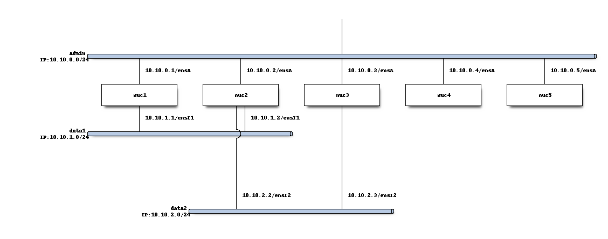

# OpenBACH Example 4 Agent : install, set up and run tests using OpenBACH

This project provides the scripts to install, to set up and run tests using OpenBACH.

This project does not prevent the reader from looking at [OpenBACH installation manual](https://wiki.net4sat.org/doku.php?id=openbach:manuals:2.x:installation_manual:index).
(in particular for the requirements on each target and instal machines)

## Usage

By cloning the current repository, the user can:

1. run the `00-install.sh` script to install OpenBACH
1. run the `10-setup.sh` script to set up an OpenBACH project

Based on this, the user can either use the auditorium scripts, the IHM or the provided scripts `20-run-quic.sh` to build and run scenarios based on `quic_configure_link` example.

## Installation details

If you encounter python-version related errors, we recommend you to either: 

* On the installation machine (nuc5) 
  * You may want to disabley key checking in ansible `export ANSIBLE_HOST_KEY_CHECKING=False`
  * Use virtual env
  * Update your paths on the installation machine, e.g. 
    * `vim ~/.bashrc`
      * add `export PYTHONPATH="$PYTHONPATH:/home/star/Desktop/openbach-extra/apis"`
      * add `export PATH="$PATH:/home/star/.local/bin"`
    * source ~/.bashrc 
* On the target machines (nuc1 .. nuc4)
  * Update the PYTHONPATH to use the correct version of python, e.g.
    * `vim ~/.bashrc`
      * add `export PYTHONPATH="$PYTHONPATH:/usr/bin/python3"`
    * source ~/.bashrc 

Five NUCs are exploited and the network architecture is showed below.
Each NUC exploits `Ubuntu 20.04` with the username `star` and the root password `azerty123`.



## netplan

```
network:
  ethernets:
    enp0s25:
      match:
        macaddress: 94:c6:91:18:bd:5e
      addresses:
      - 10.10.0.1/24
      gateway4: 10.10.0.1
      set-name: ensA
    enx503eaa3bcb9c:
      match:
        macaddress: 50:3e:aa:3b:cb:9c
      addresses:
      - 10.10.1.1/24
      gateway4: 10.10.1.1
      set-name: ensI
  version: 2
  renderer: NetworkManager
```
